# Dokumentasi Sistem SedayaClick

> **Versi Dokumen:** 1.0
> **Tanggal:** September 2026
> **Bahasa Implementasi:** Bahasa Indonesia (formal)

---

## Daftar Isi

1. [Ringkasan Sistem](#1-ringkasan-sistem)
2. [Teknologi yang Digunakan](#2-teknologi-yang-digunakan)
3. [Aktor dan Use Case](#3-aktor-dan-use-case)
4. [AlurFlow Bisnis Utama](#4-alurflow-bisnis-utama)
5. [Struktur Database](#5-struktur-database)
6. [Arsitektur Sistem](#6-arsitektur-sistem)
7. [Keamanan dan Kontrol Akses](#7-keamanan-dan-kontrol-akses)
8. [Catatan: Perbedaan dengan Spesifikasi Awal](#8-catatan-perbedaan-dengan-spesifikasi-awal)

---

## 1. Ringkasan Sistem

**SedayaClick** adalah sistem absensi dan penggajian berbasis *Progressive Web App* (PWA) yang dirancang untuk pengelolaan kehadiran karyawan secara digital. Sistem ini memungkinkan karyawan untuk melakukan *clock in* dan *clock out* menggunakan kamera dan GPS, mengajukan izin/cuti/sakit secara daring, serta memungkinkan manajemen untuk memantau kehadiran dan mengelola persetujuan pengajuan secara *real-time*.

### 1.1 Tujuan Aplikasi

- Menggantikan sistem absensi manual dengan sistem digital berbasis smartphone/browser.
- Merekam data kehadiran lengkap: waktu masuk, waktu keluar, foto wajah, koordinat GPS, durasi kerja, durasi keterlambatan, dan lembur.
- Menyediakan alur pengajuan izin/cuti/sakit yang terdokumentasi dan dapat disetujui/ditolak secara daring.
- Menghasilkan laporan rekap absensi dan pengajuan yang dapat diekspor ke format CSV maupun Excel (.xlsx).

### 1.2 Pengguna Sistem (3 Role)

| Role | Nama Teknis | Deskripsi |
|---|---|---|
| **Karyawan** | `employee` | Melakukan absensi harian (clock in/out dengan kamera + GPS), mengajukan izin/cuti/sakit, dan memantau status pengajuan miliknya sendiri. |
| **Admin Manager** | `admin_manager` | Berfokus pada Modul Pengajuan dengan hak akses lintas divisi: melihat, menyetujui, menolak, membuat, mengedit, dan menghapus pengajuan dari seluruh divisi atau difilter per divisi (setara Super Admin untuk modul pengajuan). |
| **Super Admin** | `super_admin` | Mengelola seluruh pengguna (aktivasi pendaftaran mandiri, CRUD akun), mengelola data master (divisi, jabatan, shift), memantau dashboard KPI keseluruhan organisasi, menyetujui/menolak/CRUD pengajuan lintas divisi, dan mengekspor laporan. |

### 1.3 Fitur Utama per Role

**Karyawan (`employee`)**
- Clock In harian (foto wajah + GPS wajib, validasi 1x per hari)
- Clock Out harian (foto wajah + GPS + catatan/keterangan wajib)
- Kirim pengajuan Izin / Cuti / Sakit (dengan lampiran opsional)
- Lihat riwayat pengajuan milik sendiri beserta status persetujuan

**Admin Manager (`admin_manager`)**
- Berfokus penuh pada **Modul Pengajuan (Izin / Cuti / Sakit)**
- Lihat daftar pengajuan *pending* dari seluruh divisi atau filter per divisi
- Approve / Reject pengajuan (dengan catatan alasan wajib)
- Lihat riwayat pengajuan yang sudah diproses (100 data terakhir)
- Buat pengajuan baru atas nama karyawan dari divisi manapun
- Edit dan hapus data pengajuan lintas divisi
- Form popup modal CRUD yang rapi, responsif, dan tidak tertumpuk di semua device
- Polling *real-time* 10 detik untuk sinkronisasi otomatis dengan Super Admin & Karyawan

**Super Admin (`super_admin`)**
- Dashboard KPI: jumlah hadir tepat waktu, terlambat, pending pengajuan, total karyawan aktif, pengajuan per jenis (izin/sakit/cuti), grafik distribusi absensi harian/mingguan/bulanan
- Manajemen pengguna: lihat daftar, buat akun baru, aktivasi pendaftaran mandiri, edit data, nonaktifkan/aktifkan kembali, hapus akun
- Manajemen master data: Divisi (CRUD), Jabatan (CRUD), Pengaturan Shift (CRUD)
- Lihat dan proses pengajuan lintas semua divisi (Approve/Reject/Buat/Edit/Hapus)
- Laporan rekap absensi + pengajuan lintas divisi + ekspor CSV/Excel
- Detail record absensi individual (foto, koordinat, durasi)

---

## 2. Teknologi yang Digunakan

| Kategori | Teknologi | Versi | Fungsi di Proyek |
|---|---|---|---|
| **Backend Runtime** | Node.js | — | Runtime server-side JavaScript |
| **Backend Framework** | Express.js | `^4.19.2` | Framework HTTP server, routing, middleware |
| **Database** | MySQL | — | Penyimpanan seluruh data aplikasi |
| **Driver Database** | mysql2 | `^3.10.0` | Koneksi Node.js ke MySQL, *promise-based* |
| **Autentikasi** | bcryptjs | `^2.4.3` | Hash password dengan bcrypt (cost factor 10) |
| **Manajemen Session** | express-session | `^1.18.0` | Session berbasis cookie (12 jam) |
| **Penyimpanan Session** | express-mysql-session | `^3.0.3` | Session store di MySQL agar tahan restart server |
| **Upload File** | multer | `^1.4.5-lts.1` | Menangani upload foto absensi & lampiran pengajuan (`multipart/form-data`) |
| **Ekspor Excel** | exceljs | `^4.4.0` | Menghasilkan file `.xlsx` laporan absensi & pengajuan |
| **Ekspor CSV** | json2csv | `^6.0.0-alpha.2` | Menghasilkan file `.csv` laporan absensi & pengajuan |
| **Environment Config** | dotenv | `^16.4.5` | Membaca variabel lingkungan dari file `.env` |
| **CORS** | cors | `^2.8.5` | Middleware CORS untuk mendukung *credentials* |
| **Dev Tool** | nodemon | `^3.1.0` | Auto-restart server saat kode berubah (dev only) |
| **Frontend CSS** | Tailwind CSS | CDN | Utility-first CSS untuk antarmuka dashboard |
| **Frontend JS** | Vanilla JavaScript (ES6 Modules) | — | Logika interaksi UI di browser |
| **Grafik** | Chart.js | `^4` (CDN) | Grafik batang distribusi absensi di dashboard Super Admin |
| **PWA** | `manifest.json` + `sw.js` | — | Installable app, mode *standalone*, ikon 192x512px |
| **Font** | Google Fonts — Inter | CDN | Tipografi antarmuka |

---

## 3. Aktor dan Use Case

### 3.1 Karyawan (`employee`)

| Use Case | Deskripsi |
|---|---|
| **Clock In** | Karyawan mengambil foto wajah menggunakan kamera perangkat dan mengizinkan akses GPS; sistem merekam waktu masuk, koordinat, dan menghitung keterlambatan berdasarkan shift. Hanya bisa dilakukan 1 kali per hari. |
| **Clock Out** | Karyawan mengambil foto dan mengisi catatan/keterangan wajib; sistem merekam waktu pulang, menghitung durasi kerja total dan lembur. Hanya bisa dilakukan setelah Clock In. |
| **Kirim Pengajuan** | Karyawan mengisi formulir pengajuan Izin/Cuti/Sakit (jenis, tanggal mulai-selesai, alasan, lampiran opsional). Pengajuan langsung berstatus *pending*. |
| **Lihat Riwayat Pengajuan** | Karyawan dapat melihat seluruh pengajuan miliknya beserta status (pending/approved/rejected) dan catatan alasan dari Admin. |
| **Update Profil** | Karyawan dapat memperbarui nama lengkap, nomor WhatsApp, alamat, divisi, dan jabatan via endpoint `POST /api/auth/update-profile`. |

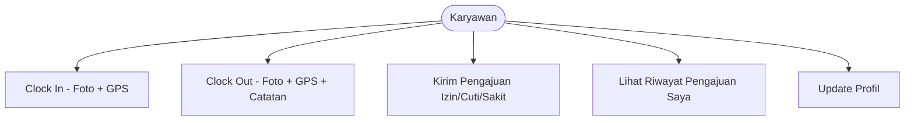

---

### 3.2 Admin Manager (`admin_manager`)

| Use Case | Deskripsi |
|---|---|
| **Lihat Pengajuan Pending** | Melihat semua pengajuan berstatus *pending* dari karyawan di divisi yang sama. |
| **Setujui / Tolak Pengajuan** | Memberikan keputusan *approved* atau *rejected* disertai catatan alasan wajib. Hanya pengajuan yang masih berstatus *pending* yang dapat diproses. |
| **Lihat Riwayat Keputusan** | Melihat 100 pengajuan terakhir yang sudah diproses (approved/rejected) dalam divisinya. |
| **Buat Pengajuan Baru** | Membuat pengajuan atas nama karyawan di divisinya dengan status awal yang bisa langsung *approved/rejected* atau tetap *pending*. |
| **Edit Pengajuan** | Mengedit data pengajuan yang ada untuk karyawan dalam divisinya. |
| **Hapus Pengajuan** | Menghapus data pengajuan secara permanen untuk karyawan dalam divisinya. |
| **Monitoring Kehadiran Tim** | Melihat status clock in/out seluruh karyawan aktif di divisinya untuk hari ini secara *real-time* (polling setiap 10 detik). |
| **Laporan & Ekspor** | Mengakses rekap absensi dan rekap pengajuan divisinya dengan filter periode, lalu mengekspor ke CSV atau Excel. |

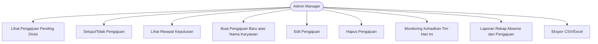

---

### 3.3 Super Admin (`super_admin`)

| Use Case | Deskripsi |
|---|---|
| **Dashboard KPI** | Melihat ringkasan metrik organisasi: jumlah hadir, terlambat, pending, karyawan aktif, pengajuan per jenis, dan grafik batang distribusi harian/mingguan/bulanan. |
| **Aktivasi Akun Pendaftaran** | Melihat daftar akun berstatus *pending* dan mengaktifkannya, opsional menetapkan role/shift. |
| **CRUD Pengguna** | Membuat akun baru langsung berstatus *active*, mengedit data pengguna, menonaktifkan/mengaktifkan kembali, dan menghapus akun beserta data absensi dan pengajuannya. |
| **Master Data Divisi** | Menambah, mengedit, dan menghapus data divisi organisasi. |
| **Master Data Jabatan** | Menambah, mengedit, dan menghapus data jabatan. |
| **Master Data Shift** | Menambah, mengedit, dan menghapus pengaturan shift kerja (nama, jam mulai, jam selesai, toleransi keterlambatan). |
| **Pengajuan Lintas Divisi** | Melihat, menyetujui/menolak, membuat, mengedit, dan menghapus pengajuan dari seluruh divisi atau difilter per divisi. |
| **Laporan & Ekspor** | Mengakses rekap absensi dan pengajuan lintas divisi dengan filter periode dan divisi, mengunduh CSV atau Excel. |
| **Detail Absensi** | Melihat detail lengkap satu record absensi termasuk foto clock in/out, koordinat GPS, dan kalkulasi durasi. |

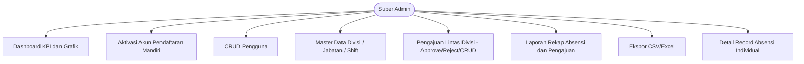

---

## 4. Alur/Flow Bisnis Utama

### 4a. Alur Pendaftaran Mandiri dan Aktivasi Akun

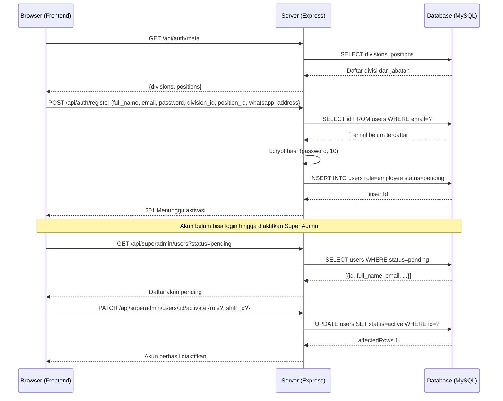

---

### 4b. Alur Login

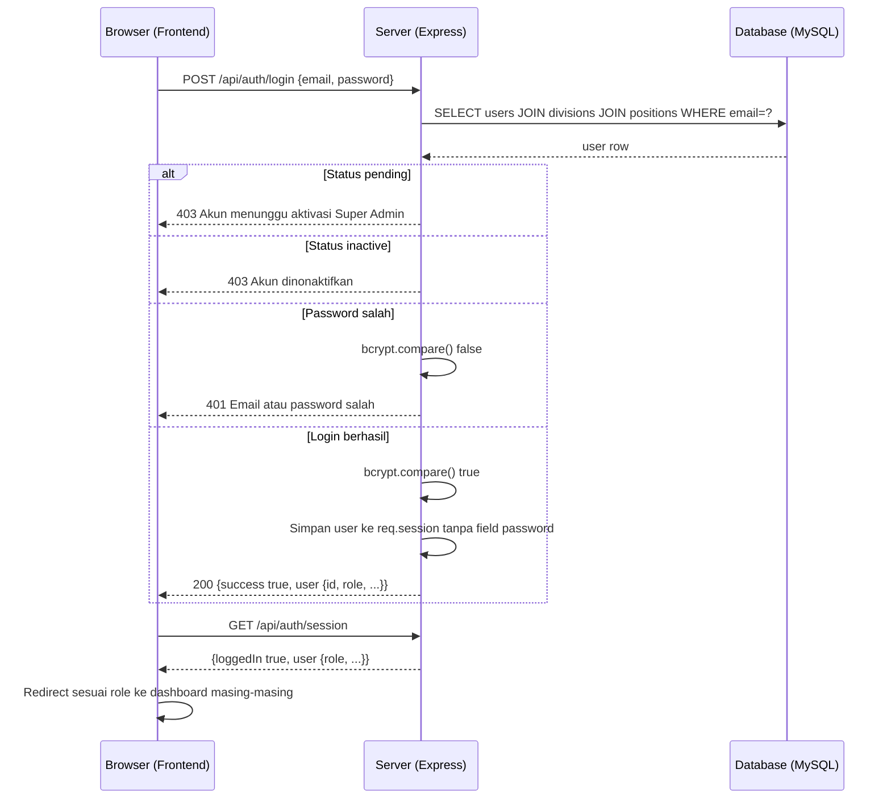

---

### 4c. Alur Clock In

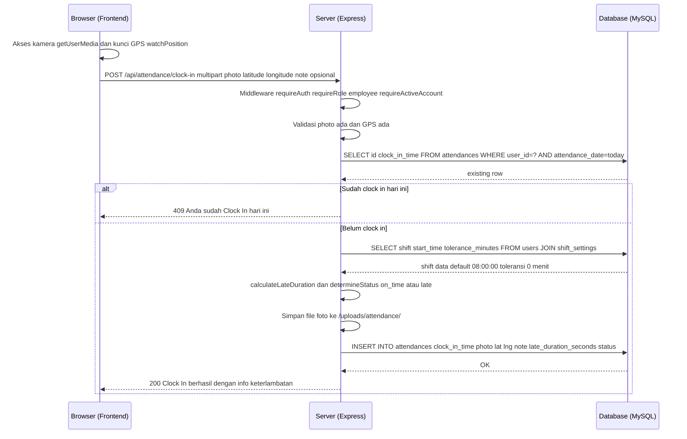

---

### 4d. Alur Clock Out

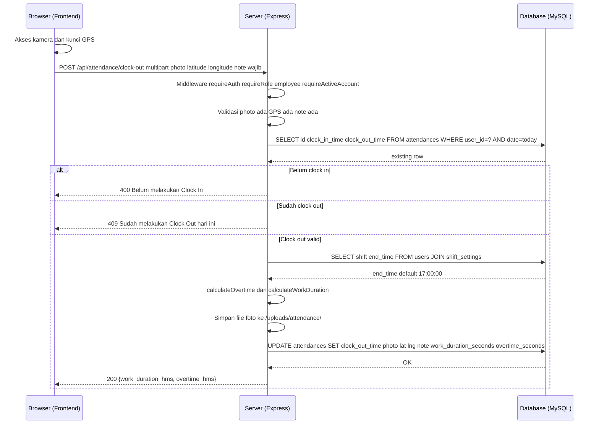

---

### 4e. Alur Pengajuan Izin/Cuti/Sakit sampai Approval

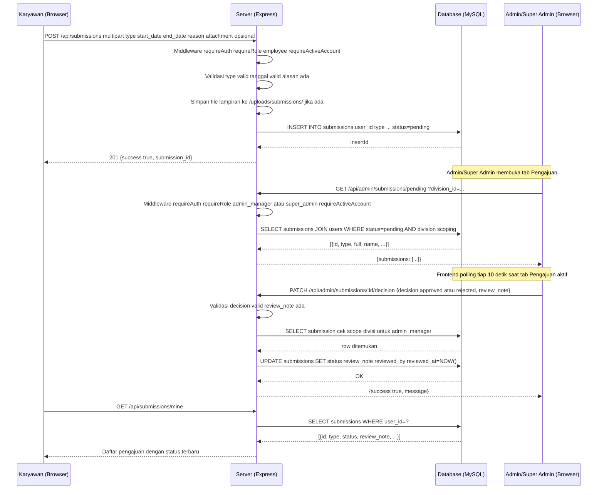

---

### 4f. Alur Generate dan Ekspor Laporan

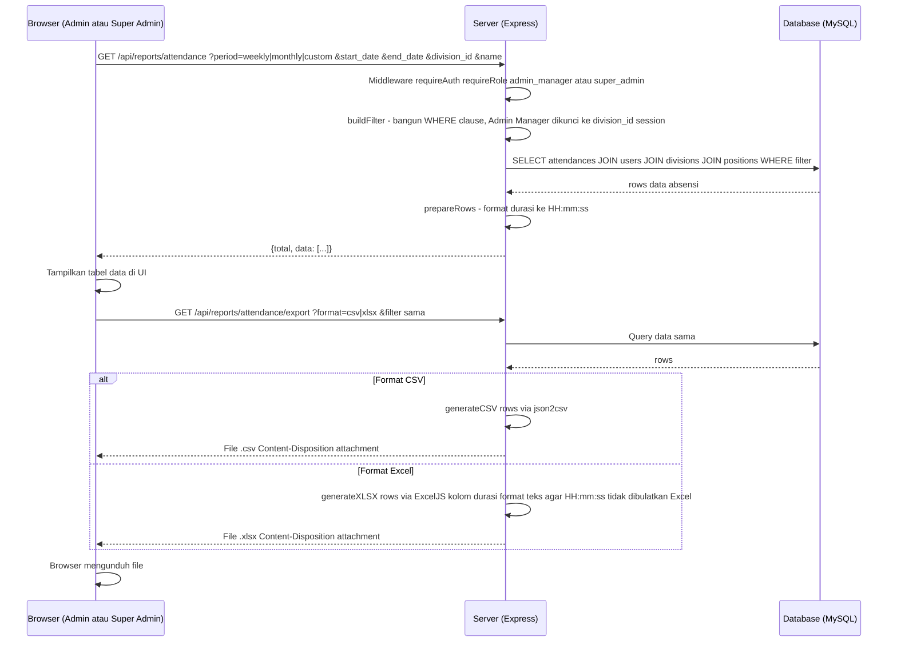

---

## 5. Struktur Database

> **Catatan:** File `config/schema.sql` pada proyek ini hanya berisi teks `npm start` (bukan DDL SQL). Struktur tabel di bawah direkonstruksi dari query SQL aktual yang ditemukan langsung di seluruh file `routes/*.js`.

### 5.1 Ringkasan Tabel

| Tabel | Fungsi | Kolom-Kolom yang Digunakan dalam Kode |
|---|---|---|
| `divisions` | Data master divisi/departemen | `id`, `name` |
| `positions` | Data master jabatan/posisi | `id`, `name` |
| `shift_settings` | Pengaturan jadwal shift kerja | `id`, `name`, `start_time`, `end_time`, `tolerance_minutes`, `is_active` |
| `users` | Data seluruh pengguna sistem | `id`, `full_name`, `email`, `password`, `whatsapp`, `address`, `role`, `status`, `division_id`, `position_id`, `shift_id`, `created_at` |
| `attendances` | Rekaman absensi harian | `id`, `user_id`, `attendance_date`, `clock_in_time`, `clock_out_time`, `clock_in_photo`, `clock_out_photo`, `clock_in_lat`, `clock_in_lng`, `clock_out_lat`, `clock_out_lng`, `clock_in_note`, `clock_out_note`, `late_duration_seconds`, `work_duration_seconds`, `overtime_seconds`, `status` |
| `submissions` | Pengajuan izin/cuti/sakit karyawan | `id`, `user_id`, `type`, `start_date`, `end_date`, `reason`, `attachment`, `status`, `review_note`, `reviewed_by`, `reviewed_at`, `created_at` |

### 5.2 Detail Kolom Penting

**Tabel `users`:**
- `role`: `'employee'` | `'admin_manager'` | `'super_admin'`
- `status`: `'pending'` (daftar mandiri, belum diaktifkan) | `'active'` | `'inactive'`

**Tabel `attendances`:**
- `status`: `'on_time'` | `'late'`
- `late_duration_seconds`, `work_duration_seconds`, `overtime_seconds`: disimpan dalam satuan detik integer

**Tabel `submissions`:**
- `type`: `'izin'` | `'cuti'` | `'sakit'`
- `status`: `'pending'` | `'approved'` | `'rejected'`
- `reviewed_by`: `users.id` dari Admin/Super Admin yang memproses
- `attachment`: path relatif file lampiran, misalnya `/uploads/submissions/filename.jpg`

### 5.3 Diagram ERD

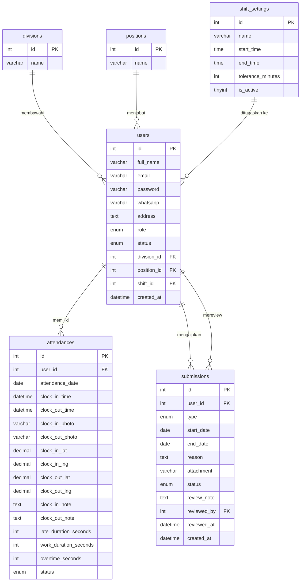

---

## 6. Arsitektur Sistem

### 6.1 Diagram Alur Request

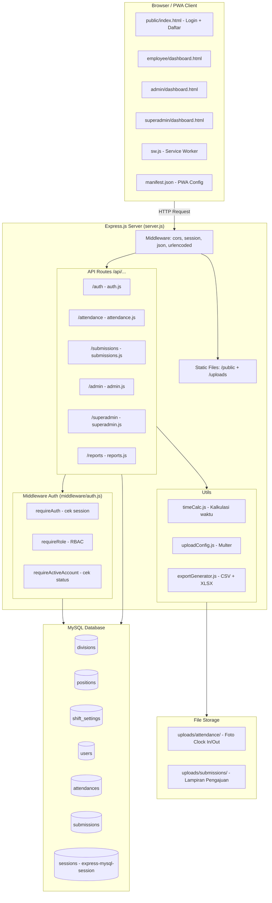

### 6.2 Struktur Folder Proyek

```
sedayaclick/
├── config/
│   ├── db.js              # Pool koneksi MySQL (mysql2/promise)
│   ├── schema.sql         # DDL pembuatan database & tabel
│   └── seed.js            # Script pembuatan akun Super Admin pertama
├── middleware/
│   └── auth.js            # requireAuth, requireRole, requireActiveAccount
├── routes/
│   ├── auth.js            # Registrasi, login, logout, session, update-profile
│   ├── attendance.js      # Clock in, clock out, status hari ini
│   ├── submissions.js     # Kirim pengajuan (employee) + lihat milik sendiri
│   ├── admin.js           # Approval, monitoring tim, CRUD pengajuan (admin+super)
│   ├── superadmin.js      # Dashboard KPI, manajemen user, master data
│   └── reports.js         # Laporan rekap absensi & pengajuan + ekspor
├── utils/
│   ├── timeCalc.js        # Kalkulasi keterlambatan, lembur, durasi kerja
│   ├── uploadConfig.js    # Konfigurasi Multer untuk foto absensi & lampiran
│   └── exportGenerator.js # Generator CSV (json2csv) & Excel (exceljs)
├── uploads/
│   ├── attendance/        # File foto clock in/out (dibuat otomatis saat startup)
│   └── submissions/       # File lampiran pengajuan (dibuat otomatis saat startup)
├── public/
│   ├── index.html         # Halaman login + form pendaftaran mandiri
│   ├── manifest.json      # PWA manifest (standalone, ikon 192/512px)
│   ├── sw.js              # Service Worker (PWA installable)
│   ├── js/
│   │   ├── api.js         # Helper fetch (apiGet, apiPost, apiPatch, dll.)
│   │   ├── pwa-register.js
│   │   └── geolocation.js
│   ├── employee/
│   │   ├── dashboard.html
│   │   └── js/employee.js
│   ├── admin/
│   │   ├── dashboard.html
│   │   └── js/admin.js
│   └── superadmin/
│       ├── dashboard.html
│       └── js/superadmin.js
├── server.js
└── package.json
```

### 6.3 Penjelasan Keputusan Arsitektur

1. **Raw SQL tanpa ORM** (disebutkan eksplisit di `README.md`): Seluruh query database ditulis langsung menggunakan `mysql2` untuk kontrol penuh terhadap performa, terutama scoping divisi yang dinamis.

2. **Session di MySQL** (`express-mysql-session`): Session disimpan di tabel MySQL agar tetap valid walau server di-restart — penting untuk PWA yang mungkin dibuka kembali setelah lama tidak aktif (komentar langsung di `server.js`).

3. **RBAC via Middleware Berantai**: Setiap route menerapkan tiga middleware berurutan: `requireAuth` → `requireRole(...)` → `requireActiveAccount`. Ini memisahkan tanggung jawab: autentikasi, otorisasi, dan validasi status akun.

4. **Scoping Pengajuan Lintas Divisi**: Admin Manager dan Super Admin memiliki akses penuh untuk mengelola pengajuan dari seluruh divisi atau memfilter per divisi via query string `division_id` di `routes/admin.js`.

5. **Upload File Terpisah**: Foto absensi di `uploads/attendance/` dan lampiran pengajuan di `uploads/submissions/`, diakses via `/uploads/...`. Folder dibuat otomatis saat server pertama kali berjalan.

6. **Frontend ES6 Modules**: Setiap dashboard menggunakan Script JS modern, memungkinkan modularisasi kode JS tanpa bundler.

7. **PWA Real-Time Polling**: Tidak menggunakan WebSocket. Data *real-time* dicapai dengan `setInterval` polling setiap 10 detik yang aktif di dashboard Admin Manager dan Super Admin untuk menjaga konsistensi data pengajuan.

---

## 7. Keamanan dan Kontrol Akses

| Role | Endpoint yang Dapat Diakses | Pembatasan Tambahan |
|---|---|---|
| **Publik (tanpa login)** | `GET /api/auth/meta`, `POST /api/auth/register`, `POST /api/auth/login` | Register langsung berstatus `pending`. Login ditolak jika `pending` atau `inactive`. |
| **Semua yang login** | `GET /api/auth/session`, `POST /api/auth/logout` | Hanya perlu session aktif |
| **Karyawan** (`employee`) | `POST /api/attendance/clock-in`, `POST /api/attendance/clock-out`, `GET /api/attendance/today`, `POST /api/submissions`, `GET /api/submissions/mine`, `POST /api/auth/update-profile` | Hanya data milik sendiri. **Tidak ada** akses ke rekap/riwayat absensi. |
| **Admin Manager** (`admin_manager`) | `GET /api/admin/submissions/pending`, `GET /api/admin/submissions/history`, `PATCH /api/admin/submissions/:id/decision`, `POST /api/admin/submissions`, `PUT /api/admin/submissions/:id`, `DELETE /api/admin/submissions/:id`, `GET /api/admin/employees` | **Modul Pengajuan Lintas Divisi** — Dapat melihat, memproses, membuat, mengedit, dan menghapus pengajuan dari seluruh atau filter divisi. |
| **Super Admin** (`super_admin`) | Semua endpoint `/api/admin/*`, `/api/reports/*`, dan semua `/api/superadmin/*` | Akses penuh seluruh sistem lintas divisi. Tidak dapat menghapus akun dirinya sendiri. |

### 7.1 Mekanisme Keamanan Tambahan

| Mekanisme | Detail |
|---|---|
| **Hash Password** | bcryptjs dengan cost factor 10. Password tidak pernah disimpan sebagai plaintext. |
| **Session Cookie** | `httpOnly: true`, `sameSite: 'lax'`, `maxAge: 12 jam`. Tidak dapat diakses JavaScript browser. |
| **Session Store MySQL** | `express-mysql-session` — session tetap valid walau server restart. |
| **Validasi Status Akun** | `requireActiveAccount` memeriksa ulang status dari session setiap request. Jika status berubah jadi `inactive`, akses ditolak walaupun session masih ada. |
| **CORS** | `origin: true, credentials: true` — perlu dikonfigurasi ulang untuk produksi. |
| **Validasi Input Server-Side** | Semua field wajib divalidasi di server sebelum operasi database dilakukan. |

---

## 8. Catatan: Perbedaan dengan Spesifikasi Awal

### 8.1 Hal yang Ada di Kode Tetapi Tidak Disebutkan di Spesifikasi Awal Dokumen Ini

1. **`POST /api/auth/update-profile`**: Endpoint pembaruan profil karyawan (nama, WhatsApp, alamat, divisi, jabatan) tersedia di `routes/auth.js` dan dikonsumsi oleh frontend.

2. **`GET /api/reports/attendance/:id`** dan **`GET /api/reports/attendance/by-user/:userId`**: Dua endpoint detail laporan di `routes/reports.js` dikonsumsi oleh modal detail absensi di frontend Super Admin.

3. **`GET /api/admin/monitoring/today`**: Endpoint monitoring tim real-time tersedia di `routes/admin.js` dan berfungsi di dashboard Admin Manager.

4. **`GET /api/admin/employees`**: Endpoint daftar karyawan untuk dropdown pembuatan pengajuan baru oleh Admin Manager/Super Admin.

5. **`GET /api/health`**: Endpoint health check sederhana di `server.js`.

### 8.2 Hal yang Perlu Perhatian

1. **`config/schema.sql`**: File ini berisi teks `npm start`, bukan DDL SQL. Struktur tabel di Bagian 5 direkonstruksi dari query SQL aktual di `routes/*.js`. Untuk dokumentasi resmi, file `schema.sql` perlu diperbarui dengan DDL yang akurat.

2. **Validasi Radius GPS**: `README.md` menyebutkan bahwa validasi pembatasan radius kantor (haversine) belum diimplementasikan — sistem saat ini hanya menyimpan koordinat tanpa memvalidasi apakah karyawan benar-benar berada di lokasi kantor.

3. **Ikon PWA**: `README.md` menyebutkan ikon di `public/icons/` adalah *placeholder* dan perlu diganti logo resmi sebelum rilis produksi.

---

*Dokumen ini dihasilkan berdasarkan pembacaan langsung dari kode sumber proyek SedayaClick: `routes/`, `middleware/`, `utils/`, `server.js`, `package.json`, `public/manifest.json`, `README.md`.*
