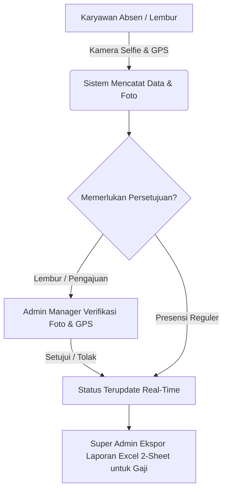

# 📊 MATERI PRESENTASI: SEDAYACLICK — ABSENSI DIGITAL & MANAGEMENT PRESENSI MULTI-ROLE

---

## 📌 SLIDE 1: JUDUL UTAMA
- **Judul**: SedayaClick — Absensi Digital & Management Presensi Karyawan Multi-Role
- **Sub-Judul**: Modul Presensi Harian, Absensi Lembur, Pengajuan Multi-Divisi, & Rekapitulasi Payroll 2-Sheet (Excel/CSV)
- **Teknologi**: Node.js, Express, MySQL2, PWA (Progressive Web App), TailwindCSS
- **Presenter**: Tim Pengembang SedayaClick

---

## 📌 SLIDE 2: LATAR BELAKANG & TANTANGAN
1. **Masalah Absensi Konvensional**:
   - Risiko manipulasi waktu & lokasi absensi (penitipan absen).
   - Pencatatan jam lembur terpisah yang membingungkan dan sulit diverifikasi.
   - Rekapitulasi laporan akhir bulan untuk penggajian (*payroll*) memakan waktu lama.
2. **Kebutuhan Perusahaan Modern**:
   - Verifikasi foto wajah (*selfie live camera*) saat absen masuk & pulang.
   - Penjagaan radius lokasi (*GPS Geolocation Lock*).
   - Alur persetujuan (*approval flow*) berjenjang sesuai divisi masing-masing.

---

## 📌 SLIDE 3: SOLUSI & KEUNGGULAN SEDAYACLICK
1. **Progressive Web App (PWA)**:
   - Didesain *mobile-first*, dapat di-install langsung ke layar utama (iOS Safari & Android Chrome).
2. **Fitur "Ingatkan Saya" (Remember Me)**:
   - Autologin otomatis dengan token terenkripsi aman saat aplikasi dibuka kembali.
3. **Modul Khusus Presensi Lembur**:
   - Pemisahan presensi jam kerja reguler dan tugas lembur.
   - Mencatat tugas lembur, foto selfie lembur, lokasi GPS, dan durasi otomatis (Jam/Menit).
4. **Rekapitulasi Laporan Excel 2-Sheet (Payroll Ready)**:
   - **Sheet 1 (Ringkasan Rekap)**: Nama, Divisi, Hadir, Terlambat, Izin, Sakit, Cuti, Lembur, Total Durasi, & **Total Hari Kerja**.
   - **Sheet 2 (Detail Pengajuan & Lembur)**: Transparansi data detail tanggal, tugas lembur, serta catatan persetujuan manajer.

---

## 📌 SLIDE 4: HAK AKSES MULTI-ROLE (3 TINGKATAN)
| Peran (Role) | Hak Akses & Wewenang Utama |
| :--- | :--- |
| **Karyawan (*Employee*)** | Absen Harian & Lembur (Kamera + GPS), Buat Pengajuan Izin/Cuti/Sakit, Cek Riwayat Presensi |
| **Admin Manager** | Verifikasi & Approval Presensi/Lembur Karyawan di Divisinya, Cek Foto & Peta GPS, Buat Pengajuan Divisi |
| **Super Admin** | Akses Global Perusahaan, Manajemen User/Divisi/Shift, Ekspor Rekap (.xlsx/.csv), Lightbox Foto & GPS Modal |

---

## 📌 SLIDE 5: ARSITEKTUR & KEAMANAN SISTEM
- **Perlindungan Berkas Terproteksi (`/secure-uploads/`)**:
  - Folder uploads publik dinonaktifkan. Seluruh berkas foto absensi hanya dapat diakses melalui otorisasi session pengguna yang sah.
- **Validasi Geolocation GPS**:
  - Mengunci koordinat latitude & longitude secara real-time dan menyediakan tombol pintas *Google Maps GPS Link*.
- **Desain UI/UX Premium**:
  - Menggunakan font *Plus Jakarta Sans*, skema warna brand yang harmonis, animasi mikro, dan dukungan *Dark Mode*.

---

## 📌 SLIDE 6: DEMO ALUR KERJA (WORKFLOW)

---

## 📌 SLIDE 7: MANFAAT NIKAT BAGI PERUSAHAAN
1. **Akurasi Data 100%**: Bebas dari manipulasi presensi & jam lembur.
2. **Efisiensi Waktu Payroll**: HR / Keuangan dapat langsung memproses gaji dari rekap 2-Sheet Excel yang terstruktur.
3. **Pengalaman Pengguna Modern**: Karyawan dapat melakukan absensi dengan cepat dan intuitif dari smartphone.

---

## 📌 SLIDE 8: KESIMPULAN & SESI TANYA JAWAB (Q&A)
- **Kesimpulan**: SedayaClick memberikan solusi presensi digital komprehensif, aman, dan siap pakai untuk meningkatkan produktivitas perusahaan.
- **Sesi Q&A**: Terima kasih! Silakan mengajukan pertanyaan atau tanggapan.
