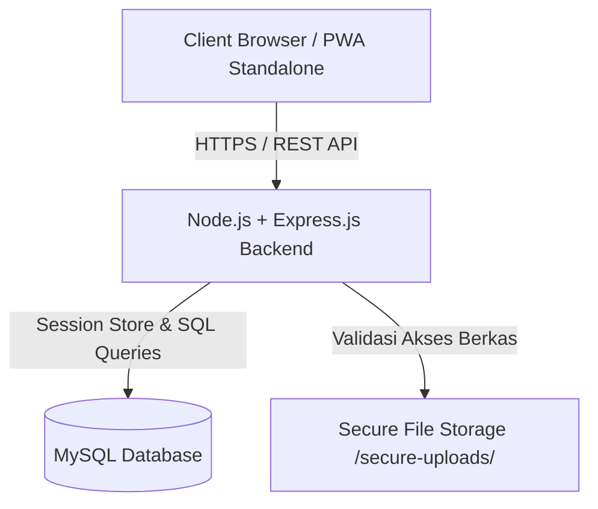
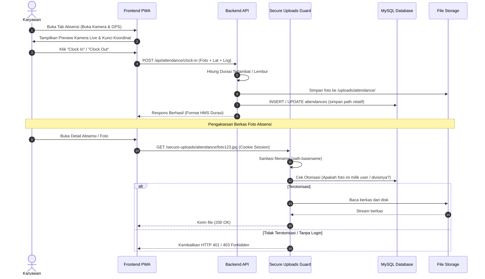
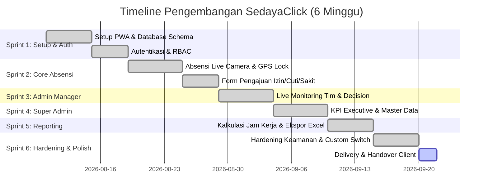

# Software Requirements Specification (SRS)
## SedayaClick — Sistem Absensi & Penggajian Digital (PWA)

---

### Informasi Dokumen
- **Nama Proyek:** SedayaClick (Absensi & Penggajian Digital PWA)
- **Versi Dokumen:** 1.0.0 (Final / Production Ready)
- **Tanggal:** 20 September 2026
- **Status Proyek:** 100% Selesai & Teruji
- **Target Pembaca:** Client, Tim Manajemen, Pengembang, & Auditor QA

---

## BAB 1: PENDAHULUAN

### 1.1 Latar Belakang & Tujuan
**SedayaClick** adalah aplikasi web progresif (*Progressive Web App / PWA*) terintegrasi yang dirancang untuk mengotomatiskan pencatatan kehadiran karyawan, pengelolaan pengajuan izin/cuti/sakit, pemantauan tim secara *real-time*, hingga kalkulasi dan pelaporan penggajian secara akurat.

Tujuan utama pembuatan sistem ini adalah:
1. Menghilangkan kecurangan absensi (*titip absen*) dengan mengunci swafoto (*live camera snapshot*) dan lokasi GPS (*geolocation*) karyawan secara wajib saat Clock In dan Clock Out.
2. Mempercepat proses persetujuan (*approval*) pengajuan izin/cuti/sakit oleh Admin Manager divisi.
3. Menyediakan eksekutif/Super Admin dengan dashboard KPI kehadiran dan alat analisis penggajian dengan durasi jam kerja, keterlambatan, dan lembur yang terhitung otomatis.
4. Memberikan pengalaman pengguna yang responsif, modern, dan dapat diinstal langsung di smartphone/desktop layaknya aplikasi native melalui teknologi PWA.

### 1.2 Ruang Lingkup Sistem
Sistem SedayaClick mencakup:
- **Client Side (PWA Frontend):** Aplikasi berbasis web responsif yang mendukung mode *standalone* tanpa address bar, dilengkapi fitur kamera WebRTC, GPS Geolocation, mode terang (*Day Mode*) & mode gelap (*Night Mode*) dengan switch pill kustom.
- **Server Side (Backend API):** RESTful API berbasis Node.js & Express.js dengan koneksi database MySQL teroptimasi (parameterized query tanpa ORM).
- **Keamanan & Otorisasi:** Sistem autentikasi berbasis session MySQL, *Role-Based Access Control* (RBAC), pembatasan akses berkas sensitif (*Secure Uploads*), pencegahan XSS, rate limiting login, serta konfigurasi header keamanan Helmet dan CORS whitelist.

### 1.3 Definisi & Akronim
| Istilah | Definisi |
| :--- | :--- |
| **PWA** | *Progressive Web App*, teknologi web yang memungkinkan aplikasi diinstal di perangkat pengguna dan berjalan tanpa address bar browser. |
| **RBAC** | *Role-Based Access Control*, pembatasan hak akses fitur berdasarkan peran akun (*Employee*, *Admin Manager*, *Super Admin*). |
| **Clock In / Out** | Proses pencatatan waktu masuk dan waktu pulang kerja karyawan. |
| **HH:mm:ss** | Format standar akumulasi durasi jam kerja, keterlambatan, dan lembur dalam jam, menit, dan detik. |
| **Path Traversal** | Celah keamanan di mana penyerang mencoba mengakses direktori terlarang di server (misal `../../etc/passwd`). |
| **XSS** | *Cross-Site Scripting*, serangan injeksi kode HTML/JavaScript liar ke dalam tampilan aplikasi. |

---

## BAB 2: DESKRIPSI UMUM SISTEM

### 2.1 Arsitektur & Teknologi (Tech Stack)



- **Frontend:** HTML5, Tailwind CSS (CDN), Vanilla JavaScript (ES6 Modules).
- **Backend:** Node.js, Express.js.
- **Database:** MySQL 8.0 / MariaDB (Driver `mysql2` dengan *Parameterized Queries* `?`).
- **Session:** `express-session` terintegrasi dengan `express-mysql-session`.
- **Security:** `helmet`, `express-rate-limit`, `cors`, `bcryptjs`.
- **File Processing & Export:** `multer` (Upload foto & lampiran), `exceljs` (Ekspor Excel `.xlsx`), `json2csv` (Ekspor CSV).

### 2.2 Hak Akses Pengguna (Matrix Peran / RBAC)

| Fitur / Modul | Karyawan (*Employee*) | Admin Manager | Super Admin |
| :--- | :---: | :---: | :---: |
| Login & Pendaftaran Mandiri | v | v | v |
| Clock In / Clock Out (Kamera + GPS) | v | - | - |
| Pengajuan Izin / Cuti / Sakit + Lampiran | v | v (Atas nama karyawan) | v |
| Lihat Riwayat Pengajuan Mandiri | v | v | v |
| Lihat Rekap/Riwayat Absensi Pribadi | **TIDAK (Sesuai Aturan)** | - | - |
| Monitoring Kehadiran Tim Divisi (Real-Time) | - | v | v |
| Approval / Rejection Pengajuan Divisi | - | v | v |
| Manajemen User & Aktivasi Akun | - | - | v |
| Manajemen Master Data (Divisi, Jabatan, Shift) | - | - | v |
| Executive KPI Dashboard & Grafik | - | - | v |
| Ekspor Laporan Absensi & Penggajian (CSV/Excel) | - | - | v |

---

## BAB 3: SPESIFIKASI KEBUTUHAN FUNGSIONAL

### Modul 1: Autentikasi & Akun
- **FR-1.1 Pendaftaran Mandiri:** Karyawan dapat mendaftar mandiri memilih divisi & jabatan. Akun baru langsung berstatus `pending`.
- **FR-1.2 Aktivasi Akun:** Akun berstatus `pending` atau `inactive` ditolak saat login hingga diaktifkan oleh Super Admin.
- **FR-1.3 Session Management:** Session login disimpan di database MySQL (tahan *server restart*) dengan durasi 12 jam.
- **FR-1.4 Profile Update:** Karyawan dapat memperbarui informasi nama, WhatsApp, dan alamat.

### Modul 2: Absensi Digital (Clock In & Clock Out)
- **FR-2.1 Swafoto Wajib (*Live Camera*):** Mengambil foto langsung via WebRTC kamera depan/belakang.
- **FR-2.2 Penguncian GPS:** Lokasi koordinat Latitude & Longitude dikunci dan disimpan pada setiap transaksi absensi.
- **FR-2.3 Pembatasan Transaksi:** Maksimal 1 catatan absensi per karyawan per hari kalender.
- **FR-2.4 Kalkulasi Otomatis:**
  - *Keterlambatan:* Selisih waktu Clock In aktual terhadap (jam mulai shift + toleransi).
  - *Lembur:* Selisih waktu Clock Out aktual terhadap jam selesai shift.
  - *Durasi Kerja:* Selisih waktu Clock Out terhadap Clock In.
  - Seluruh durasi disimpan dalam unit **detik** di DB dan disajikan dalam format `HH:mm:ss`.

### Modul 3: Formulir Pengajuan (Izin / Cuti / Sakit)
- **FR-3.1 Pengajuan Mandiri:** Karyawan dapat mengajukan izin, cuti, atau sakit dengan mengisi tipe, tanggal mulai, tanggal selesai, alasan, dan berkas lampiran (surat sakit/dokumen).
- **FR-3.2 Status Tracking:** Karyawan dapat memantau status persetujuan (`pending`, `approved`, `rejected`) beserta catatan dari Admin.

### Modul 4: Dashboard & Approval Admin Manager
- **FR-4.1 Live Monitoring Tim:** Menampilkan status kehadiran seluruh karyawan di divisinya secara *real-time* (sinkronisasi otomatis polling 10 detik).
- **FR-4.2 Decision Engine:** Admin Manager dapat menyetujui atau menolak pengajuan dengan mencantumkan catatan alasan keputusan.
- **FR-4.3 Pengajuan atas Nama Karyawan:** Admin Manager dapat membuat, mengedit, atau menghapus pengajuan untuk anggota divisinya.

### Modul 5: Dashboard Executive & Master Data Super Admin
- **FR-5.1 KPI Executive:** Menampilkan statistik akumulasi kehadiran tepat waktu, terlambat, izin, sakit, cuti, dan pengajuan pending.
- **FR-5.2 Grafik Kehadiran:** Visualisasi tren statistik harian/mingguan/bulanan menggunakan Chart.js.
- **FR-5.3 Manajemen Akun:** Fitur aktivasi pendaftaran mandiri, pengubahan peran, penonaktifan, dan penghapusan pengguna.
- **FR-5.4 Master Data Management:** Pengelolaan daftar Divisi, Jabatan, dan Pengaturan Shift (jam mulai, jam selesai, toleransi keterlambatan dalam menit).

### Modul 6: Penggajian & Pelaporan Lanjutan (Export)
- **FR-6.1 Multi-Filter Laporan:** Filter data berdasarkan rentang periode (harian, 7 hari terakhir, 30 hari terakhir, custom tanggal), divisi, dan pencarian nama.
- **FR-6.2 Format Jam Presisi Excel (`.xlsx`):** Durasi jam kerja, keterlambatan, dan lembur pada file Excel diset dengan format teks (`numFmt: '@'`) sehingga nilai `HH:mm:ss` tidak dibulatkan atau mengalami eror perhitungan >24 jam.
- **FR-6.3 Format CSV (`.csv`):** Menyediakan unduhan data mentah terstruktur.

### Modul 7: Hardening Keamanan (Security Requirements)
- **FR-7.1 Protected File Access (`/secure-uploads/`):** Folder `uploads/` publik dinonaktifkan. Seluruh berkas foto/lampiran diakses melalui endpoint terproteksi `/secure-uploads/` dengan pemeriksaan otorisasi session & kepemilikan data.
- **FR-7.2 Anti Path-Traversal:** Menggunakan `path.basename()` untuk mensterilkan parameter nama berkas.
- **FR-7.3 XSS Escaping:** Seluruh data teks masukan pengguna di-escape menggunakan fungsi `escapeHtml()` sebelum dirender ke dalam `innerHTML` frontend.
- **FR-7.4 Rate Limiter Login & Register:** Endpoint login membatasi maks 5 percobaan gagal per 15 menit per kombinasi IP + email (login sukses tidak dihitung). Endpoint registrasi membatasi maks 20 request/menit per IP.
- **FR-7.5 CORS & Security Headers:** CORS dibatasi sesuai `ALLOWED_ORIGIN` di environment variable. Paket `helmet` aktif untuk memasang header keamanan HTTP.

---

## BAB 4: USE CASE & ALUR SISTEM

### 4.1 Use Case Diagram (Keseluruhan Sistem)

```mermaid
usecaseDiagram
    actor Karyawan as "Karyawan (Employee)"
    actor Admin as "Admin Manager"
    actor SuperAdmin as "Super Admin"

    package "Sistem SedayaClick" {
        usecase UC1 as "Login & Registrasi Mandiri"
        usecase UC2 as "Clock In & Clock Out (Foto + GPS)"
        usecase UC3 as "Buat Pengajuan (Izin/Cuti/Sakit)"
        usecase UC4 as "Lihat Status Pengajuan Pribadi"
        usecase UC5 as "Monitoring Kehadiran Tim Divisi"
        usecase UC6 as "Approve / Reject Pengajuan Divisi"
        usecase UC7 as "Manajemen User & Aktivasi Akun"
        usecase UC8 as "Manajemen Master Data (Divisi/Shift)"
        usecase UC9 as "Lihat Executive KPI & Grafik"
        usecase UC10 as "Ekspor Laporan (CSV / Excel)"
        usecase UC11 as "Akses Berkas Foto/Lampiran Terproteksi"
    }

    Karyawan --> UC1
    Karyawan --> UC2
    Karyawan --> UC3
    Karyawan --> UC4
    Karyawan --> UC11

    Admin --> UC1
    Admin --> UC5
    Admin --> UC6
    Admin --> UC11

    SuperAdmin --> UC1
    SuperAdmin --> UC7
    SuperAdmin --> UC8
    SuperAdmin --> UC9
    SuperAdmin --> UC10
    SuperAdmin --> UC11
```

### 4.2 Sequence Diagram: Alur Absensi & Proteksi Berkas



---

## BAB 5: KEBUTUHAN NON-FUNGSIONAL (NON-FUNCTIONAL REQUIREMENTS)

1. **Performa & Responsivitas:**
   - Halaman PWA memuat kurang dari 1.5 detik pada jaringan 4G.
   - Sinkronisasi monitoring kehadiran Admin Manager berlangsung otomatis setiap 10 detik tanpa penundaan antarmuka (*non-blocking*).
2. **Keamanan Data & Privasi:**
   - Password pengguna di-hash menggunakan algoritma `bcrypt` dengan *salt round* 10.
   - Direktori penyimpanan foto dan dokumen tidak dapat diindeks oleh mesin pencari atau dibuka secara bebas tanpa session login aktif.
3. **Usability & Aesthetic Interface:**
   - Desain modern berstandar tinggi dengan Tailwind CSS, dilengkapi sakelar mode terang/gelap (*Day/Night Mode Pill Switch*) yang responsif di desktop maupun perangkat seluler.
4. **Reliabilitas:**
   - Penyimpanan session di database MySQL menjamin pengguna tidak ter-logout secara tidak sengaja saat server di-restart.

---

## BAB 6: TIMELINE PENGERJAAN & ROADMAP PROYEK

Proyek SedayaClick diselesaikan secara bertahap dalam **6 Sprint / Milestone** utama dengan durasi total pengerjaan 6 Minggu:



### Rincian Serah Terima Berkas (*Deliverables Checklist*)

- [x] **Source Code Backend:** Node.js + Express.js API ([server.js](file:///Applications/XAMPP/xamppfiles/htdocs/sedayaclick/server.js), [routes/](file:///Applications/XAMPP/xamppfiles/htdocs/sedayaclick/routes/), [utils/](file:///Applications/XAMPP/xamppfiles/htdocs/sedayaclick/utils/)).
- [x] **Source Code Frontend:** Application Shell PWA ([public/](file:///Applications/XAMPP/xamppfiles/htdocs/sedayaclick/public/)).
- [x] **Skema Database & Seeder:** [config/schema.sql](file:///Applications/XAMPP/xamppfiles/htdocs/sedayaclick/config/schema.sql) & [config/seed.js](file:///Applications/XAMPP/xamppfiles/htdocs/sedayaclick/config/seed.js).
- [x] **Konfigurasi Environment:** Sample [.env.example](file:///Applications/XAMPP/xamppfiles/htdocs/sedayaclick/.env.example) & [.env](file:///Applications/XAMPP/xamppfiles/htdocs/sedayaclick/.env).
- [x] **Dokumentasi SRS & Panduan Penggunaan:** [README.md](file:///Applications/XAMPP/xamppfiles/htdocs/sedayaclick/README.md) & Dokumen SRS resmi ini.

---
*Dokumen ini dibuat secara resmi untuk digunakan sebagai acuan teknis dan serah terima proyek SedayaClick.*
